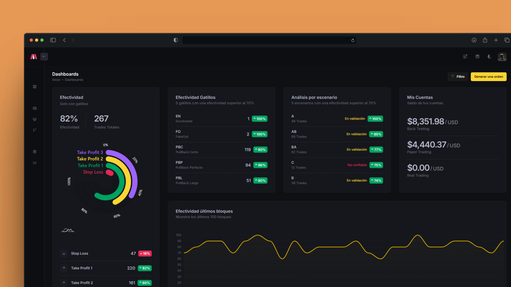

# TradingBook

_Plataforma web para análisis de performance en trading cripto._

TradingBook es una plataforma web creada para centralizar el registro y análisis de operaciones de trading en criptomonedas.

Su objetivo es transformar la ejecución operativa en información accionable, permitiendo evaluar setups, medir efectividad, detectar patrones y mejorar la toma de decisiones a partir de datos reales. El proyecto fue desarrollado con **.NET 8** y **Clean Architecture**, con un enfoque en escalabilidad, mantenibilidad y evolución del producto.

## Stack

- **.NET 8**
- **ASP.NET Core MVC**
- **Entity Framework Core**
- **SQL Server**
- **Clean Architecture**
- **Bootstrap**
- **JavaScript**
- **Chart.js**

# Documentación de la Estructura del Proyecto - ASP.NET Core

Este proyecto utiliza el enfoque de arquitectura limpia para organizar el código, facilitando la separación de responsabilidades, la escalabilidad y el mantenimiento. A continuación, se describe la estructura de carpetas y archivos del proyecto.

## **Capas del Proyecto**

### **1. Application**
Contiene la lógica de aplicación y define las interfaces, DTOs y servicios necesarios para interactuar con otras capas.

- `DTOs/` 
   Objetos de transferencia de datos utilizados para encapsular y transportar datos entre capas.

- `Interfaces/` 
   Contratos que definen la lógica que deben implementar las clases concretas.

- `Models/` 
   Modelos que representan estructuras utilizadas en el contexto de la lógica de aplicación.

- `Resources/` 
   Archivos de recursos como cadenas localizadas o configuraciones específicas.

- `Services/` 
   Servicios de aplicación que implementan la lógica específica del negocio.

- `DependencyInjection.cs` 
   Configuración para registrar los servicios de Application en el contenedor de dependencias.

- `GlobalUsings.cs` 
   Archivo para declarar los using globales que simplifican las referencias en esta capa.

---

### **2. Domain**
Representa el núcleo del negocio y contiene las entidades, valores constantes y enumeraciones.

- `Constants/` 
   Valores constantes que son utilizados en toda la aplicación.

- `Entities/` 
   Clases que representan las entidades del dominio con sus propiedades y comportamientos.

- `Enums/` 
   Enumeraciones que representan conjuntos de valores predefinidos.

- `GlobalUsings.cs` 
   Archivo para declarar los using globales que simplifican las referencias en esta capa.

---

### **3. Infrastructure**
Proporciona implementaciones concretas para las interfaces definidas en `Application`. Incluye servicios para correo electrónico, identidad, logging, persistencia y más.

- `Email/` 
  Lógica relacionada con el envío de correos electrónicos.

- `Identity/` 
  Manejo de autenticación y autorización.

- `Logging/` 
  Configuración y servicios relacionados con el registro de eventos.

- `Persistence:`
    - `Data/` 
      Contiene el `DbContext` para interactuar con la base de datos.

    - `Repositories/` 
      Implementaciones de repositorios para acceder a los datos.

- `DependencyInjection.cs` 
  Configuración para registrar los servicios de Infrastructure en el contenedor de dependencias.

- `GlobalUsings.cs` 
  Archivo para declarar los using globales que simplifican las referencias en esta capa.

---

### **4. Web**
Proyecto ASP.NET Core en .NET 8 que actúa como punto de entrada de la aplicación. Incluye controladores, middlewares, y configuraciones específicas para la interacción con los usuarios y servicios externos.
- `Pages/`  
  Contiene las Razor Pages que definen la UI y la lógica de presentación.

- `Controllers/`  
  Incluye controladores para endpoints adicionales, como APIs o acciones especializadas.

- `Views/`  
  Vistas compartidas y parciales, así como layouts reutilizables.

- `wwwroot/`  
  Archivos estáticos (CSS, JS, imágenes, plantillas).
  
- `Template/`  
    Recursos de plantillas, scripts personalizados y plugins.

- `Media/Logos/`  
    Almacena logotipos y recursos gráficos.
---

## **Consideraciones Generales**
- La separación en capas asegura una alta cohesión dentro de cada capa y un bajo acoplamiento entre ellas.
- `DependencyInjection.cs` en cada capa se utiliza para registrar sus servicios específicos en el contenedor de dependencias global de ASP.NET Core.
- `GlobalUsings.cs` simplifica la gestión de espacios de nombres en los archivos de cada capa.

Esta estructura permite que el código sea modular, testable y fácilmente extensible, facilitando la colaboración en equipos grandes y el mantenimiento a largo plazo.

# Documentación

## Configuración del archivo `appsettings.json`
1. Copia el archivo `appsettings.json` del repositorio.
2. Rellena los valores necesarios, como la cadena de conexión y cuenta de correo.